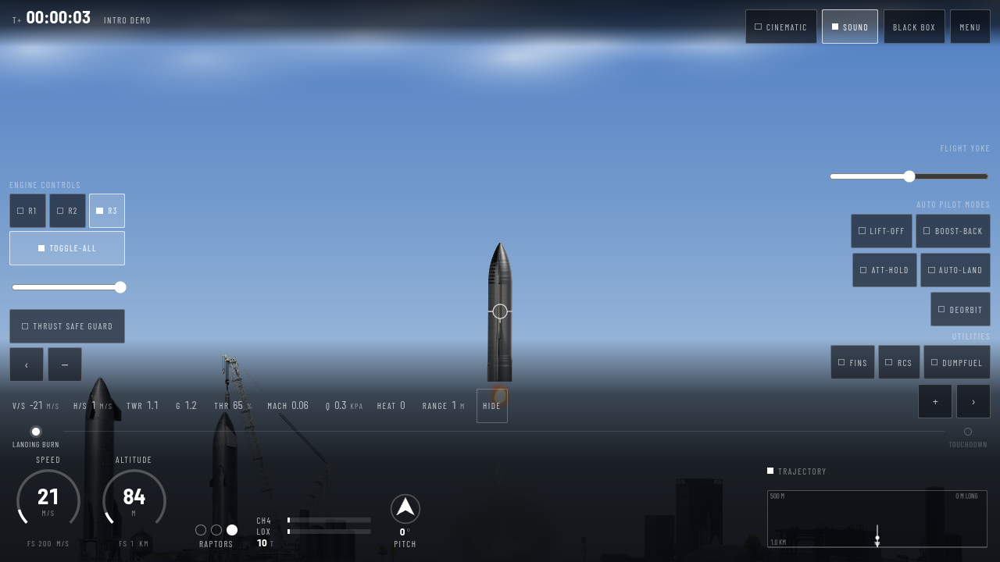
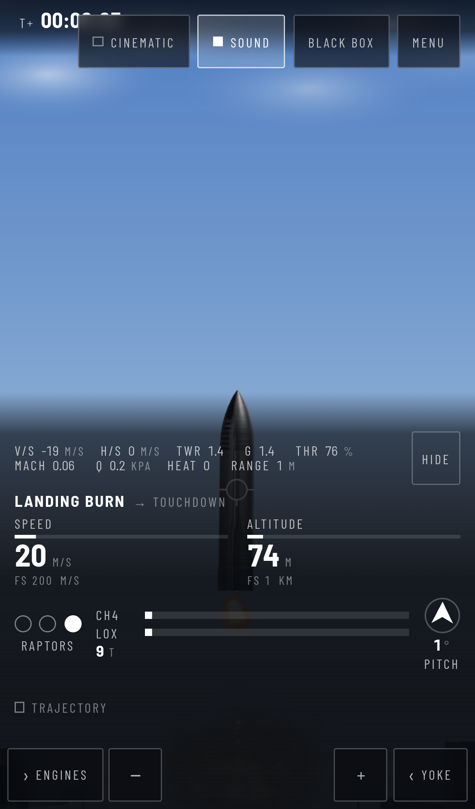
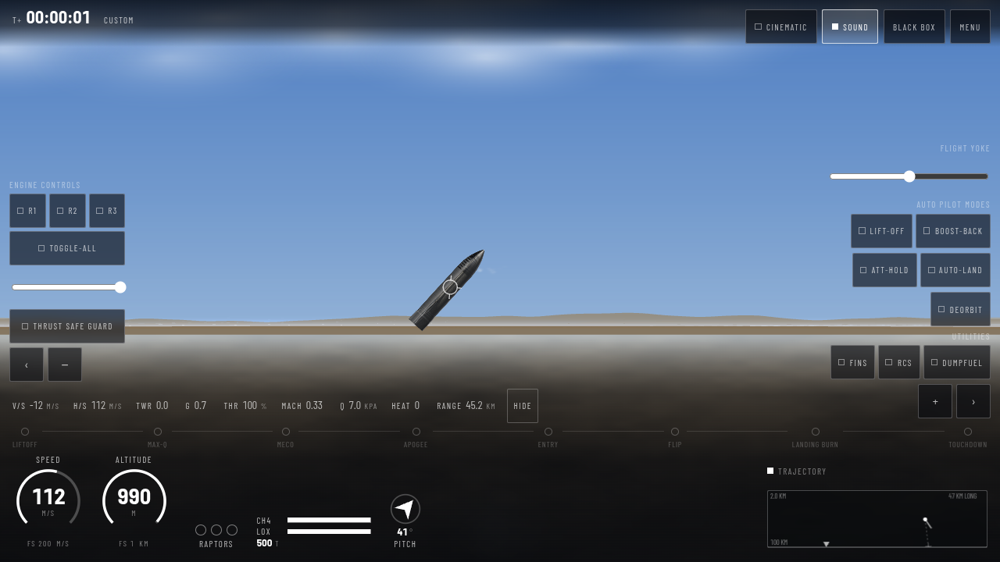
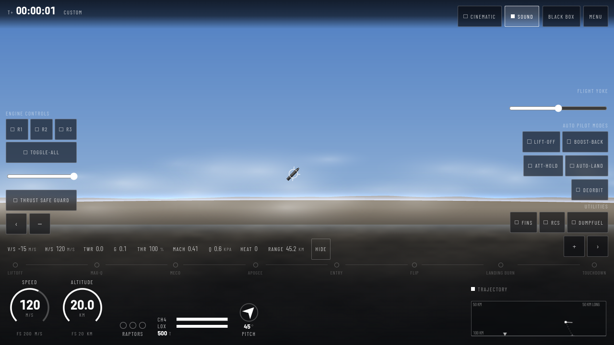
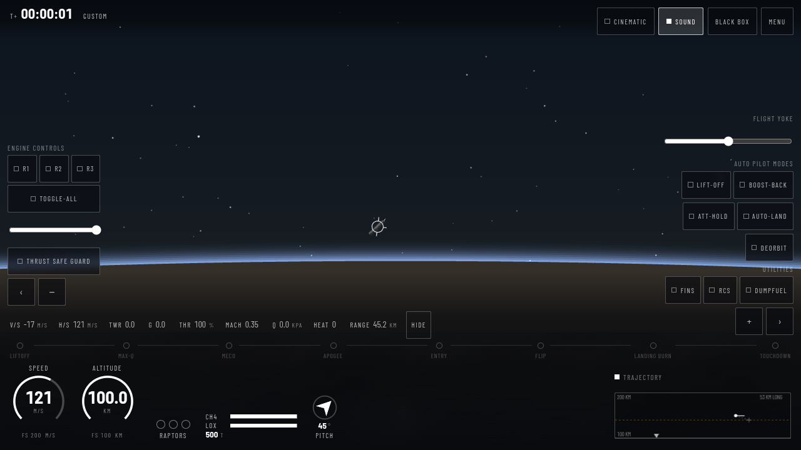

# Starship Simulator

A Starship flight simulator that runs in a browser. Land it yourself, or watch the
autopilot do it.



Originally written in 2021 as a first project. This is v2: that flight model extracted
line by line, locked behind golden trajectory fixtures, and only then taken where the
2021 one could not go — real gravity, the full standard atmosphere, a Raptor whose thrust
rises as the air thins, and a centre of mass that moves as the tanks drain.

It works on a phone, and not by shrinking: the dials become digits and ticks, the
event timeline collapses to what just happened and what is next, and the flight
controls become bottom sheets with real touch targets.



### It looks like altitude

The camera opens up as you climb — 200 m of world at the pad, a kilometre by
20 km — and three layers move at three rates beneath it: the ground at true
scale, a cloud deck at 2.5 km, and a compressed-perspective earth that keeps the
world on screen the whole way instead of losing it at a hundred metres. Above
the air, velocity streaks carry the speed the world no longer can.

There is a sun. It is where the sun would be — from StarBase's latitude, at the hour the
scenario starts — and the hull is lit from it, the ground darkens away from it, and the
sky reddens when it is low. Above the air the stars are the three hundred and twenty
brightest in the Bright Star Catalogue, placed by right ascension and declination for that
site and hour: on a September evening the Summer Triangle is overhead, Orion's belt is
three stars in a line a degree and a half apart, and Orion itself is behind you, because
that is where it is in September. Re-entry puts a plasma sheath on the windward side of
the hull, gated by the angle of attack so the belly flop's fire is on the belly, with an
onboard camera inset showing the same thing close up. The camera has four modes — follow,
the pad camera that holds still while the vehicle climbs out of frame, a chase view, and
onboard — chosen from the selector Cinematic mode adds where the flight controls were.

A trajectory map in the corner draws the profile you have flown and the
touchdown you are heading for — or says `NO SOLUTION — ORBIT` when there isn't
one. The ring on the ship is the flight-path marker: where the vehicle is
actually going, as against where its nose points. On a re-entry those differ by
ninety degrees.

<p>



</p>


That picture was impossible until August 2026, and not because nobody took it.
The view was driven by the wall clock while the simulation was driven by its
own, so a `Re-entry` put the vehicle 1734 px off the left edge of a 1280 px
frame within four seconds of loading — and the follow law gave up beyond half a
viewport, so it never came back. Every screenshot anyone could have taken of a
re-entry was a screenshot of an empty sky. See `docs/GRAPHICS-PLAN.md`.

---

## Playing it

It opens with the autopilot landing a Starship. When it touches down the vehicle is
yours — full tanks, engines off.

- **Fly it**: the yoke on the right pitches the nose; the slider on the left is the
  throttle; `R1`/`R2`/`R3` and `Toggle-All` light the Raptors.
- **Or don't**: `Lift-Off`, `Boost-Back`, `Att-Hold` and `Auto-Land` will do it for you.
  `Auto-Land` from any altitude is worth watching at least once.
- **Menu** → scenario presets, from a booster separation at 70 km to a landing burn at
  200 m, plus two orbital ones. Or type your own numbers into the six fields.
- **Black Box** → nine plots of the flight you just flew.
- **Keyboard**: WASD or the arrow keys, `Space` for all engines, `1`/`2`/`3` for one,
  `F` fins, `R` RCS, `T` attitude hold, `Backspace` boost-back, `=`/`-` zoom. The full
  list is in the guide, and it is generated from the binding table, so it cannot drift.

Works offline. Install it and it keeps working with the network off — the whole thing
is precached, including the chart library.

### It sounds like altitude too

The simulator was silent for its whole life, 2021 and v2 alike. It is not now,
and the point is not the noise — it is the contrast. Engine rumble is
synthesised from the throttle and the number of Raptors actually lit, so three
engines at 40% and two at 100% sound as different as they are. Airflow noise
rises with dynamic pressure and brightens with Mach.

Then the air runs out. Above 50 km the airflow is gone — there is no mechanism
by which a vacuum roars — while the engine falls to a floor rather than to
silence, because structural conduction is real and you are bolted to the thing.
A vacuum where everything is quieter sounds like the volume being turned down.
A vacuum where the air stops and the vehicle does not sounds like space.

Nothing plays before you touch something: browsers require a gesture, and the
intro is better silent than fighting for it. The `Sound` button remembers what
you chose, and muting suspends the audio context rather than turning a gain
down, so a muted simulator does no audio work at all.

---

## The interface

It is built on the design language of a SpaceX launch webcast, which is a very
particular thing: the world fills the frame and the data annotates it from the
edges, legibility comes from one gradient rising off the bottom rather than from
boxes drawn around things, and the entire palette is white at four opacities.
Colour appears only where it means something — amber approaching a limit, red
past it.

The parts that carry it:

- **Dial-and-digit gauges.** The arc gives rate of change at a glance, the numeral
  inside gives the value, and the scale auto-ranges so an arc three quarters full
  means something at 200 m/s and at 8 km/s alike.
- **State is physical.** Engines are dots that light — and go red individually when
  one fails. Propellant is a bar that drains. Nothing says "on" by turning a word
  green.
- **A mission timeline**, derived from the simulation and never scripted: LIFTOFF,
  MAX-Q, MECO, ENTRY, FLIP, LANDING BURN, TOUCHDOWN. Fly badly and the events
  simply do not light, which is the honest thing for a game you can freestyle.
- **Cinematic mode** hides the flight controls, leaving exactly the broadcast. It is
  the one deliberate departure: a webcast never shows a button because the viewer
  cannot press anything, and this is a cockpit.

Every number on screen still goes through a single `requestAnimationFrame`
subscriber that diffs before it writes. The gauges and the timeline are attributes
rather than text, so they are diffed as integers — a still gauge costs nothing.

---

## What this is, really

The 2021 version worked, and it was a mess in ways that are worth naming, because
every one of them is a rule in this codebase now:

- 355 globals on `globalThis`
- physics that ran at a different speed depending on your frame rate
- `document.getElementById` inside the simulation loop
- engine ignition timed with `setTimeout`, so it fired early under time warp
- 3.5 MB of Plotly from a CDN on every page load, for charts almost nobody opened
- an About screen claiming it worked offline, while loading two CDNs

The rebuild's central bet was **extraction, not rewrite**. The flight model is the
thing worth keeping — it took a long time to tune and it feels right. So it was ported
line by line, misspellings included, then locked behind golden trajectory fixtures
before anything was allowed to change. Only then was it safe to refactor.

That order matters. A rewrite would have produced a cleaner codebase flying a subtly
different vehicle, and nobody would have been able to say which parts changed.

### The result

| | 2021 | v2 |
|---|---|---|
| Globals | 355 | 0 (lint-enforced) |
| Simulation step | frame-rate dependent | fixed 120 Hz, 5.6–12.2 µs (budget 1000) |
| HUD | 12 Hz, 18 `getElementById` per update | 120 Hz, zero lookups, diffed writes |
| First-load JS | ~3.5 MB, two CDNs | 215.8 kB gzip, no third-party origins |
| Offline | claimed | tested — a full flight with the network off |
| Interface | one desktop layout | three breakpoints, gated on four phone viewports |
| Depth | ground, then nothing above 100 m | three parallax layers, camera FOV 1x–5x with altitude |
| Sound | silent | synthesised from SimState; the atmosphere audibly runs out |
| Physics | one gravity, one speed of sound, one air density | planet-centred gravity, the full ISA, local Mach, Raptor thrust against ambient pressure, a moving centre of mass |
| Integrator | Euler at whatever dt the frame gave | velocity Verlet at a fixed dt, second-order and checked against Kepler |
| Tests | 0 | 1463 unit, 355 end-to-end across five browser projects |

---

## Architecture

Dependencies point down. Only down.

```
v2/src/ui/     Svelte 5 — panels, menu, editor, black box. Interaction-driven only.
v2/src/hud/    The HUD binder. One rAF subscriber, diffs state, writes text nodes.
v2/src/view/   PixiJS v8 — sprites, pooled particles, camera, sky. No game logic.
v2/src/app/    The loop, input, the flight recorder, offline support.
v2/src/audio/  Web Audio graph and the SimState → sound bindings. Never imported by core/.
v2/src/core/   Pure TypeScript simulation. The protected zone.
```

The 2021 build is still in the repository, at `v2/tests/fixtures/legacy/`. It is retired —
not built, not served, and since August 2026 not a reference either. For nine milestones
416 parity tests executed it in a Node VM and compared v2 value for value, which is what
made the port safe to refactor; then the owner retired parity as a standard, on the
grounds that "the old one is just a fun project, we have a much higher standard now".
Those tests are deleted and nothing under `v2/` reads that tree. Correctness now means
agreement with closed-form physics, published reference data and stated contracts —
things that are true whatever any implementation does. The archive stays so nine
milestones of porting citations keep resolving. See `docs/VERIFICATION-PLAN.md`.

`core/` is pure: state in, state out. It runs in Node with no browser, which is what
makes any of this testable.

**Seven walls** — six of them autopsies of a specific 2021 failure, each an ESLint
error, each with a test that feeds it a violation and asserts it fails:

1. `core/` may not import from `view/`, `ui/`, `hud/` or `app/`.
2. `core/` may not touch `document`, `window` or PIXI.
3. `core/` may not call `Math.random` — seeded streams only, counters in state.
4. `core/` may not call `Date.now` or `performance.now` — time enters as `dt`.
5. `core/` may not call `setTimeout` or `setInterval`.
6. Nothing anywhere in `v2/` may assign to `globalThis`.
7. `core/` may not import from `audio/` — sound is an output, never an input. The one
   wall with no 2021 wound behind it, because the 2021 build made no sound at all.

### Determinism

`step(state, dt, input)` is pure: same state, same dt, same input, identical output.
Randomness comes from a counter-based generator seeded per stream, with the counters
stored in the state, so a flight replays exactly. Time warp runs the step loop N times
per frame; it never scales `dt`, because a step must always mean the same thing.

Golden trajectory fixtures in `v2/tests/golden/` are the behavioural contract, and since
parity was retired they are the only guard on behaviour. A refactor that moves one fails
`npm run test`, and moving one on purpose costs a tier justification and a row in an audit
table naming which flights changed and why.

### Nothing changes physics silently

Every change to `core/` declares one tier in its commit message:

| Tier | Meaning | What it owes |
|---|---|---|
| Refactor | behaviour must not change | numerical proof over the input domain, ≤ 1 ULP, committed as a test |
| Bug fix | provably wrong today | failing test first, then the fix, then a before/after trajectory diff |
| Fidelity | more accurate, changes feel | the owner's explicit say-so, named in the commit; goldens regenerate with the justification |

The bug fixes so far: a pitch-rate term that was only correct at exactly 60 fps, a
heating correlation given an area where it wanted a radius, an unclamped keyboard
throttle that could command 210%, and a random-failure toggle that did nothing.

The fidelity work — planet-centred gravity, speed of sound from local temperature, the
full ISA table, the collapsed trig ladders, Raptor thrust against ambient pressure,
velocity Verlet, a centre of mass that moves with the propellant — was built behind flags
and shipped without them: the owner retired the flag machinery, and the tuned 2021 feel
with it, once each piece could be shown to be more right rather than merely different.

The collapsed trig ladders are the best illustration of why the tiers are worth having.
Collapsing seven quadrant ladders to seven one-line identities is provably the same
mathematics, to within one ULP over four million sampled angles, and it *still* moves a
golden fixture, because a third of those angles differ in the final bit and the simulation
is a feedback loop. A proof of mathematical identity is not a proof of bit-identity.

---

## Development

```bash
cd v2
npm install
npm run dev        # vite dev server
npm run lint       # eslint, including the seven walls
npm run build      # svelte-check, vite build, service worker, bundle budget
npm run test       # vitest — 1463 tests. Needs a build: the offline suite reads dist/
npm run coverage   # the same, with enforced floors on src/core/**
npm run test:e2e   # playwright — 355 tests across five projects, ~50 min
npm run test:deploy  # the same build served from a subdirectory, as Pages does

npm run gate       # all five, in that order. This is the bar for a commit.
```

Build before test, and the order matters: `tests/offline.test.ts` asserts things about
the shipped output, so `dist/` is its fixture rather than a later step.

The build fails if first-load JS exceeds 250 kB gzip. That is deliberate: the budget is
a test, not a guideline.

### Continuous integration

`.github/workflows/ci.yml` runs lint, build, the bundle budget, the unit suite, the
coverage floors, the desktop browser project against the production build, and the subpath
deploy shape — on every push to every branch.

It ran red from the second commit of the project until M11.9: 121 runs, one green, and
that one before the first test existed. The cause was the ordering above. `npm run test`
ran before `npm run build`, nine offline tests threw `ENOENT` on a directory that did not
exist yet, and the job stopped there — so the build, the budget and both browser suites
never ran at all, on any commit, for eleven milestones. A hundred and twenty red runs said
the same nine words and nobody read one of them. It is fixed, and the fix is four lines of
YAML swapped; the eleven milestones of unread red is the part worth remembering.

CI runs one of the five browser projects, and the gap is worth naming rather than
implying: the five tests tagged `@mobile-only` — the phone's sheets and their focus trap,
its digits-and-ticks readouts, its one-line timeline, its folded map — run in no CI project
at all. Nor do the
four phone viewports, because several of those specs are timing measurements and a shared
runner is not an idle machine; the same specs have failed on nothing but CPU contention.
`npm run gate` on a quiet machine, run by a person, is still the bar.

### Deploying

Pushing to `main` builds, runs the same gates, and publishes to GitHub Pages. Pages serves a
project site from a subdirectory rather than a domain root, which is why the build uses
vite's `base: './'` and the service worker precaches scope-relative paths — and why
`npm run test:deploy` exists to serve the real build from a subdirectory and prove it.
An absolute path anywhere in the build works perfectly on localhost and 404s in
production; that is not a bug worth finding from a user's bug report.

### Documents

- [`CLAUDE.md`](CLAUDE.md) — the constitution. Read it before changing anything.
- [`docs/REBUILD-PLAN.md`](docs/REBUILD-PLAN.md) — the plan and its reasoning.
- [`docs/ROADMAP-TASKS.md`](docs/ROADMAP-TASKS.md) — every task, and a log of what each one found.
- [`docs/PARITY.md`](docs/PARITY.md) — v2 against the 2021 feature list, line by line.
- [`docs/RENAME-MAP.md`](docs/RENAME-MAP.md) — the mechanical rename, old name to new.
- [`docs/BROADCAST-UI-PLAN.md`](docs/BROADCAST-UI-PLAN.md) — the interface: what was studied,
  what was taken, and the one thing deliberately not copied.
- [`docs/DEPTH-AND-SPEED-PLAN.md`](docs/DEPTH-AND-SPEED-PLAN.md) — why a 356 m viewport makes
  orbital speed look like standing still, and the trajectory map that answers it.
- [`docs/SOUND-PLAN.md`](docs/SOUND-PLAN.md) — the silence, and what it would take to end it.
- [`docs/GRAPHICS-PLAN.md`](docs/GRAPHICS-PLAN.md) — what a re-entry with no vehicle in it
  turned out to mean, and the plan for particles, clouds and ground that follows from it.
- [`docs/VERIFICATION-PLAN.md`](docs/VERIFICATION-PLAN.md) — what replaced parity: coverage
  measured rather than claimed, and correctness argued against closed-form physics.
- [`docs/NEXT-LEVEL-PLAN.md`](docs/NEXT-LEVEL-PLAN.md) — the physics and graphics of M11,
  and the interface work of M12, each phase surveyed on evidence before it was planned.

---

## Credits

Built by [SteveIsnthere](https://github.com/SteveIsnthere). The pig is at x = 0 and is
not negotiable.
